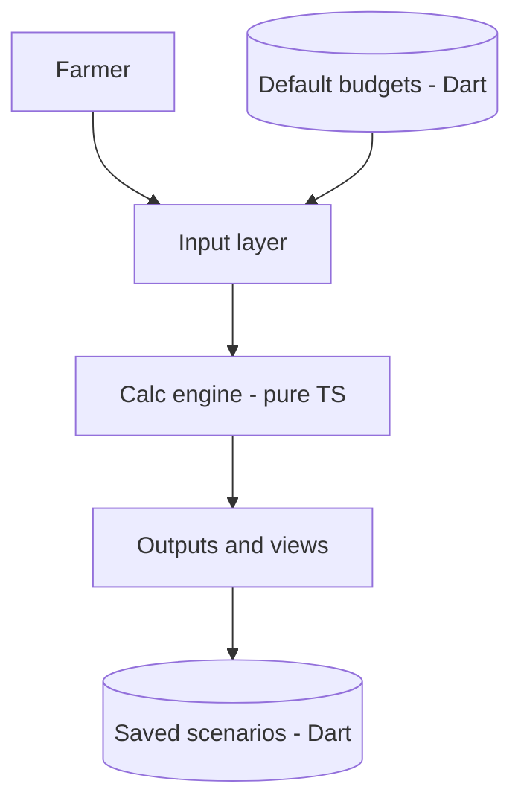

# Grain Margin Manager — v1 Alignment Doc

**Purpose:** A shared reference so the two of us can build v1 in parallel without our numbers drifting. Please read this before we split the work.

**Stack:** Next.js / React / TypeScript (frontend) · Dart (backend)
**Last updated:** 2026-06-13

---

## 1. What we're building

A web app that gives a US Midwest corn/soybean grower a per-acre profitability snapshot. The user enters their crops, yields, prices, and costs, and we show **net margin per acre** and the **breakeven price** ("what do I need to sell at to be profitable?"), plus an interactive **price × yield sensitivity** view.

This replaces the clunky extension spreadsheets (Iowa State / FarmDoc style) with something that gets to a credible first number from ~5 inputs and lets the user drag price/yield to watch the answer move.

---

## 2. v1 scope

**In:**
- Crops: corn and soybeans (one optional "other" slot).
- Per-crop inputs: yield (APH or expected), cash price, optional government payment.
- Per-crop cost inputs: the standard direct-expense lines (pre-filled with regional defaults, all editable) **plus** land cost and machinery cost as single `$/acre` numbers.
- Outputs: per-crop P&L card, breakeven price & yield, net margin; whole-farm dollar rollup; interactive sensitivity grid (price × yield → margin).
- Save / load a scenario.

**Out (deferred to v2):**
- Grain marketing log & insurance position tracking.
- A3-29 machinery cost engine (depreciation / capital recovery). In v1, machinery cost is just a number the user types or accepts from a default.
- Detailed sub-calculators (fertilizer by N-P-K, equipment, facility, land amortization).
- PDF report (v1 ships at most a minimal export).
- User accounts / auth (optional — see Open Questions).

---

## 3. Core principle (please don't skip this)

> **The calculation engine lives only in the frontend, in TypeScript. The Dart backend does NOT compute margins or breakevens — it stores data and serves defaults.**

Why this matters: with one side in TS and one in Dart, the single biggest failure mode is implementing the same formulas twice and watching the two implementations drift apart. So in v1 there is exactly **one** implementation of the math, and it is client-side. The backend treats a scenario as opaque data (plus an optional results snapshot it never recomputes).

Bonus: client-side math is what makes the sensitivity sliders feel instant — no round trip per drag.

---

## 4. Data flow



Frontend owns everything from `Input layer` through `Outputs`. Backend owns the two stores: `Default budgets` (read on load) and `Saved scenarios` (persistence). The only two crossings are: defaults flow in on load, the scenario flows out on save.

---

## 5. Division of labor

### Frontend — k3nny (Next.js / React / TypeScript)
- All UI: input forms, per-crop P&L card, whole-farm summary, interactive sensitivity heatmap / sliders.
- The entire calc engine as pure TS functions (see §7).
- State management (input state → derived calc state). `useState`/`useReducer` or a light store (e.g. Zustand) — nothing heavy for v1.
- Calls to the two backend endpoints (fetch defaults on load, save/load scenarios).
- Input validation + formatting (currency, bu/acre).

### Backend — teammate (Dart)
- Serve default crop budgets, keyed by `year` + `region`. Source: ISU Budgets, IL FarmDoc, MN FINBIN — use 2026 figures and record the source per line so the UI can attribute them.
- Persist scenarios (the full input payload + an optional results snapshot).
- (Optional) user accounts / auth.
- **No calculation logic.**

---

## 6. The contract (the one thing we must agree on first)

### Endpoints

| Method | Path | Purpose |
|---|---|---|
| `GET`  | `/defaults?year=2026&region=midwest` | Default budget for the UI to seed inputs |
| `POST` | `/scenarios` | Save a scenario → returns `{ id }` |
| `GET`  | `/scenarios/:id` | Load a scenario |
| `PUT`  | `/scenarios/:id` | Update a scenario (optional in v1) |

### Scenario schema — single source of truth

Define this once (TS type below + a mirrored JSON Schema / OpenAPI), and generate or hand-align the Dart types from it. **Any change to this schema is a shared decision and goes through both of us.**

```ts
type CropKey = "corn" | "soybeans" | "other";
type CostSource = "default" | "user";

interface CostLine {
  key: string;        // stable id, e.g. "seed"
  label: string;      // display label, e.g. "Seed/Plants (Treated)"
  value: number;      // $/acre
  source: CostSource; // was it a default, or did the user edit it?
}

interface CropEntry {
  crop: CropKey;
  acres: number;
  yieldBasis: "aph" | "expected";
  yieldBuPerAcre: number;
  cashPricePerBu: number;
  govtPaymentPerAcre: number;   // averaged over acres; default 0
  directCosts: CostLine[];      // the ~17 lines below
  landCostPerAcre: number;      // single manual number in v1
  machineryCostPerAcre: number; // single manual number in v1
}

interface Scenario {
  id?: string;
  year: number;
  region: string;               // e.g. "midwest"
  farm: { name?: string; address?: string };
  crops: CropEntry[];
  familyLiving?: {              // optional in v1; defaults to 0
    annualLivingExpense: number;
    annualNonFarmIncome: number;
  };
  createdAt?: string;
  updatedAt?: string;
}
```

### Defaults payload shape

```ts
interface DefaultsResponse {
  year: number;
  region: string;
  interestRatePct: number;
  crops: Record<CropKey, {
    directCosts: CostLine[];      // all with source: "default"
    landCostPerAcre: number;
    machineryCostPerAcre: number;
  }>;
  sources: { label: string; url: string }[];  // attribution shown in the UI
}
```

### Direct-cost line keys (stable ids — agree on these now)

`chemicals_herbicide`, `fungicide_insecticide`, `crop_insurance`, `custom_hire`, `labor_hired`, `fertilizer_lime`, `fuel_oil`, `insurance`, `operating_interest`, `repairs_maintenance`, `seed`, `storage_drying`, `supplies`, `trucking_freight`, `utilities`, `other_1`, `other_2`

These mirror the line items in the reference spreadsheet's Farm Margin Manager tab.

---

## 7. Calculation reference (frontend implements; both read)

All figures are per-acre unless noted. These mirror the spreadsheet exactly.

```
revenuePerAcre         = yield × cashPrice + govtPayment
totalDirectExpense     = sum of directCosts[].value
totalCapitalExpense    = landCost + machineryCost
netFamilyLivingPerAcre = max(0, annualLivingExpense − annualNonFarmIncome) / totalAcres   // optional
totalExpensePerAcre    = totalDirectExpense + totalCapitalExpense + netFamilyLivingPerAcre
netMarginPerAcre       = revenuePerAcre − totalExpensePerAcre
breakevenPrice         = totalExpensePerAcre / yield        // "what I must sell at"
breakevenYield         = totalExpensePerAcre / cashPrice
```

**Whole-farm:** multiply each crop's per-acre figures by that crop's acres, then sum across crops.

**Sensitivity grid** — holds expenses fixed, varies price & yield:

```
margin(price, yield) = (yield × price)
                       − (totalDirectExpense + totalCapitalExpense + netFamilyLivingPerAcre)
                       + govtPayment
```

Output is a 2D array over a price range × yield range, rendered as a heatmap.

### Function signatures (frontend)

```ts
revenuePerAcre(c: CropEntry): number
totalDirectExpense(c: CropEntry): number
totalCapitalExpense(c: CropEntry): number
totalExpensePerAcre(c: CropEntry, netFamilyLivingPerAcre?: number): number
netMarginPerAcre(c: CropEntry, netFamilyLivingPerAcre?: number): number
breakevenPrice(c: CropEntry, netFamilyLivingPerAcre?: number): number
breakevenYield(c: CropEntry, netFamilyLivingPerAcre?: number): number
sensitivityGrid(c: CropEntry, priceRange: number[], yieldRange: number[]): number[][]
wholeFarm(s: Scenario): { revenue: number; expense: number; netMargin: number }
```

### Sanity-check values (from the reference spreadsheet)

Use these to verify the engine produces the right numbers:

| Crop | Yield | Price | Total expense/ac | Net margin/ac | Breakeven |
|---|---|---|---|---|---|
| Corn | 210 bu | $4.20 | $952 | **−$70** | **$4.533/bu** |
| Soybeans | 60 bu | $10.20 | $684 | **−$72** | **$11.40/bu** |

---

## 8. Working agreement

1. **Step 1 (together):** lock the `Scenario` schema + `DefaultsResponse` shape in §6. Nothing else starts until this is signed off.
2. **Step 2 (parallel):** frontend mocks `/defaults` and builds the full engine + UI + sensitivity; backend builds `/defaults` + persistence against the agreed schema. Neither side is blocked on the other.
3. **Step 3:** integrate against the real endpoints.
4. Schema changes are a shared decision, versioned in this repo.

---

## 9. Open questions (decide together)

- **Auth:** include in v1, or local-only with an optional save?
- **Region:** single value for v1 (just `"midwest"`), or sub-regions / states now?
- **Family living:** include in v1 (it affects breakeven in the spreadsheet) or defer to v2?
- **Defaults refresh:** where do the default numbers get updated each season, and who owns that?
